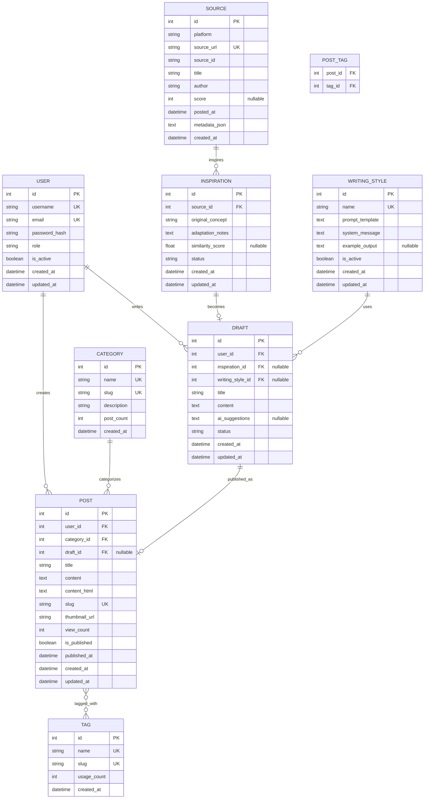

# NewsKoo 데이터베이스 ERD (Entity Relationship Diagram)

## 개요

유머 콘텐츠 재창작 플랫폼의 데이터베이스 스키마 설계

---

## 핵심 엔티티

### 1. User (사용자/관리자)
- 관리자 계정 관리
- 게시물 및 초안 작성자

### 2. Post (게시물)
- 완성되어 발행된 콘텐츠
- 프론트엔드에 표시되는 최종 결과물

### 3. Source (소스)
- Reddit 등 외부 소스의 메타데이터
- 저작권 준수: 전체 콘텐츠 저장 안함, URL과 메타데이터만

### 4. Inspiration (영감)
- Source로부터 영감을 받은 아이디어
- 재창작 전 단계

### 5. Draft (초안)
- 작성 중인 콘텐츠
- AI 보조 또는 수동 작성

### 6. Category (카테고리)
- 유머 유형 분류 (일상, 풍자, 말장난 등)

### 7. Tag (태그)
- 게시물 태깅 (검색 및 분류)

### 8. WritingStyle (작성 스타일)
- AI 프롬프트 템플릿
- 재사용 가능한 작성 스타일

---

## ERD 다이어그램

---

## 관계 설명

### User → Post (1:N)
- 한 사용자가 여러 게시물 작성 가능
- `user_id` FK in Post

### User → Draft (1:N)
- 한 사용자가 여러 초안 작성 가능
- `user_id` FK in Draft

### Category → Post (1:N)
- 한 카테고리에 여러 게시물
- `category_id` FK in Post

### Post ←→ Tag (N:N)
- 게시물은 여러 태그 가질 수 있음
- 태그는 여러 게시물에 사용됨
- 중간 테이블: `post_tag`

### Source → Inspiration (1:N)
- 하나의 소스에서 여러 영감 도출 가능
- `source_id` FK in Inspiration

### Inspiration → Draft (1:1, optional)
- 영감이 초안으로 발전할 수 있음
- `inspiration_id` FK in Draft (nullable)

### Draft → Post (1:1, optional)
- 초안이 게시물로 발행될 수 있음
- `draft_id` FK in Post (nullable)

### WritingStyle → Draft (1:N)
- 작성 스타일을 여러 초안에 적용 가능
- `writing_style_id` FK in Draft (nullable)

---

## 인덱스 전략

### Primary Keys
- 모든 테이블에 `id` (auto-increment)

### Unique Constraints
- `users.username`
- `users.email`
- `posts.slug`
- `sources.source_url`
- `categories.name`, `categories.slug`
- `tags.name`, `tags.slug`
- `writing_styles.name`

### Foreign Key Indexes
- `posts.user_id`
- `posts.category_id`
- `posts.draft_id`
- `drafts.user_id`
- `drafts.inspiration_id`
- `drafts.writing_style_id`
- `inspirations.source_id`

### Additional Indexes
- `posts.is_published` (published 필터링)
- `posts.published_at` (정렬)
- `posts.created_at` (정렬)
- `sources.platform` (플랫폼별 검색)
- `sources.posted_at` (시간순 정렬)
- `inspirations.status` (상태 필터링)
- `drafts.status` (상태 필터링)

---

## Enum 타입 정의

### UserRole
- `admin` - 관리자
- `editor` - 편집자
- `writer` - 작성자

### DraftStatus
- `idea` - 아이디어 단계
- `writing` - 작성 중
- `ai_assisted` - AI 보조 중
- `review` - 검토 중
- `completed` - 완료
- `abandoned` - 중단

### InspirationStatus
- `collected` - 수집됨
- `reviewing` - 검토 중
- `approved` - 승인됨
- `in_progress` - 작업 중
- `completed` - 완료됨
- `rejected` - 거절됨

### SourcePlatform
- `reddit` - Reddit
- `other` - 기타

---

## 데이터 제약사항

### User
- `username`: 3-50자, 영문/숫자/언더스코어
- `email`: 유효한 이메일 형식
- `role`: enum 값만 허용

### Post
- `title`: 1-200자
- `content`: 최소 10자
- `slug`: URL-safe 문자열
- `view_count`: >= 0
- `is_published`: 발행 시 `published_at` 자동 설정

### Source
- `source_url`: 유효한 URL
- `platform`: enum 값만 허용

### Inspiration
- `similarity_score`: 0.0 ~ 1.0 (70% 미만 권장)

### Category/Tag
- `name`: 1-50자
- `slug`: URL-safe 문자열

---

## 타임스탬프

모든 주요 테이블에 공통 필드:
- `created_at`: 생성 시각 (자동)
- `updated_at`: 수정 시각 (자동 갱신)

일부 테이블 추가:
- `posts.published_at`: 발행 시각
- `sources.posted_at`: 원본 게시 시각

---

## 소프트 삭제 (향후 고려)

Phase 2에서는 미구현, Phase 후반에 추가 가능:
- `deleted_at` 필드
- 실제 삭제 대신 타임스탬프 기록

---

## 캐싱 전략 (향후)

Phase 2에서는 미구현, 성능 최적화 시:
- `posts.view_count` - Redis 카운터
- `categories.post_count` - 주기적 업데이트
- `tags.usage_count` - 주기적 업데이트

---

**설계 원칙**:
- ✅ 정규화 (3NF)
- ✅ 명확한 관계 정의
- ✅ 저작권 준수 (Source는 메타데이터만)
- ✅ 확장 가능한 구조
- ✅ 성능 고려 (인덱스)

**다음 단계**: SQLAlchemy 모델 구현
